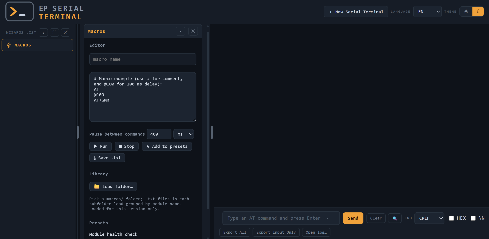
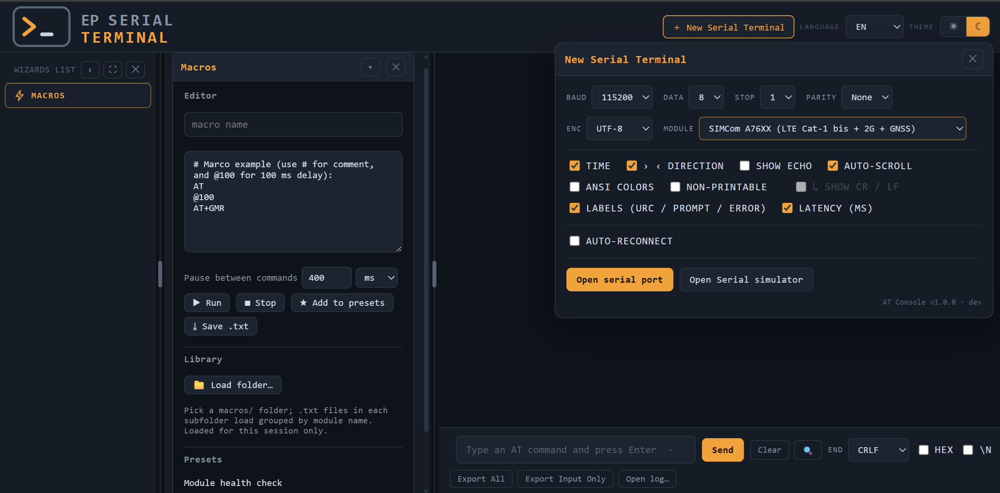
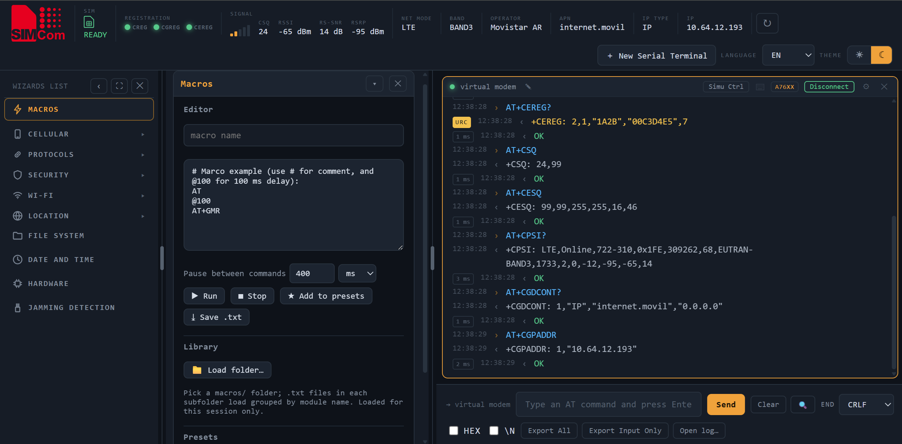

# EP Serial Terminal

Browser-based Serial Terminal to test communications modules, using AT commands with intelligent macros, log and visual wizzards. It includes simulator for several modules. No install required.

## License

3-Clause BSD License, see LICENSE.txt

## Usage

Download the code as .zip or clone, and open `index.html`, you will see the "EP Serial Terminal":

You can open up to 8 serial terminals connected to phisical serial ports (COM or tty) or simulated ports:

As example we use a simulated port, with selected SIMCom A76XX module:

